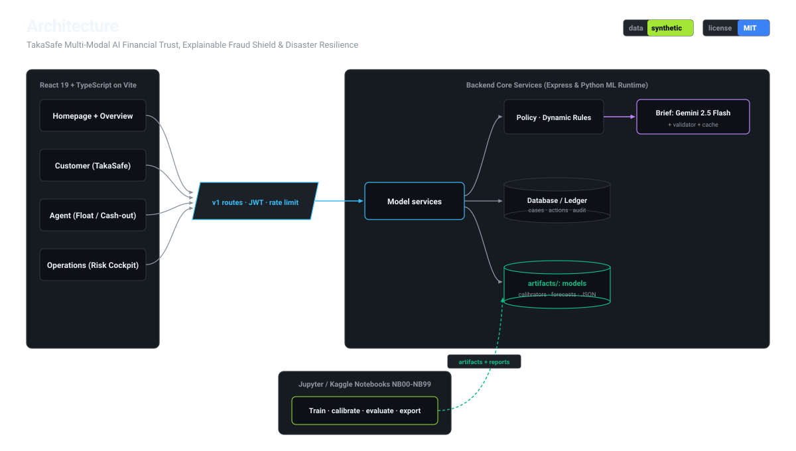
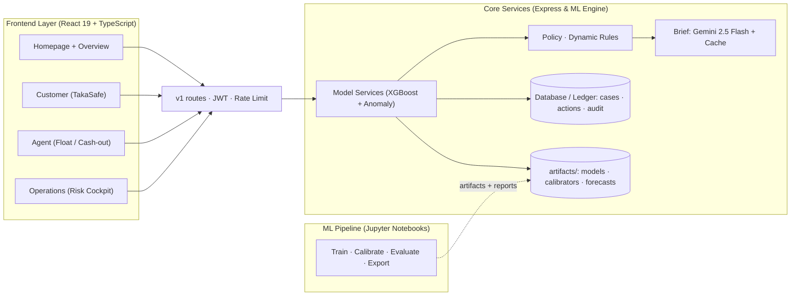
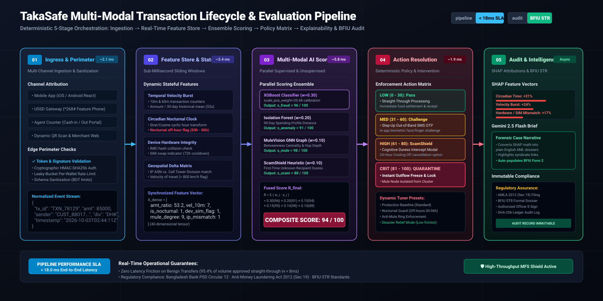
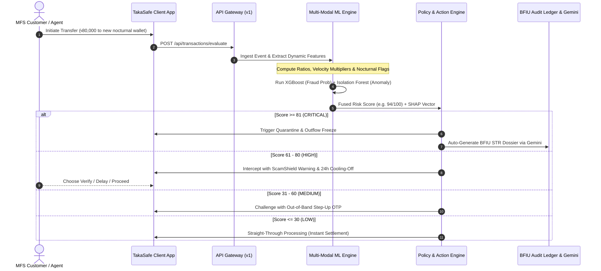
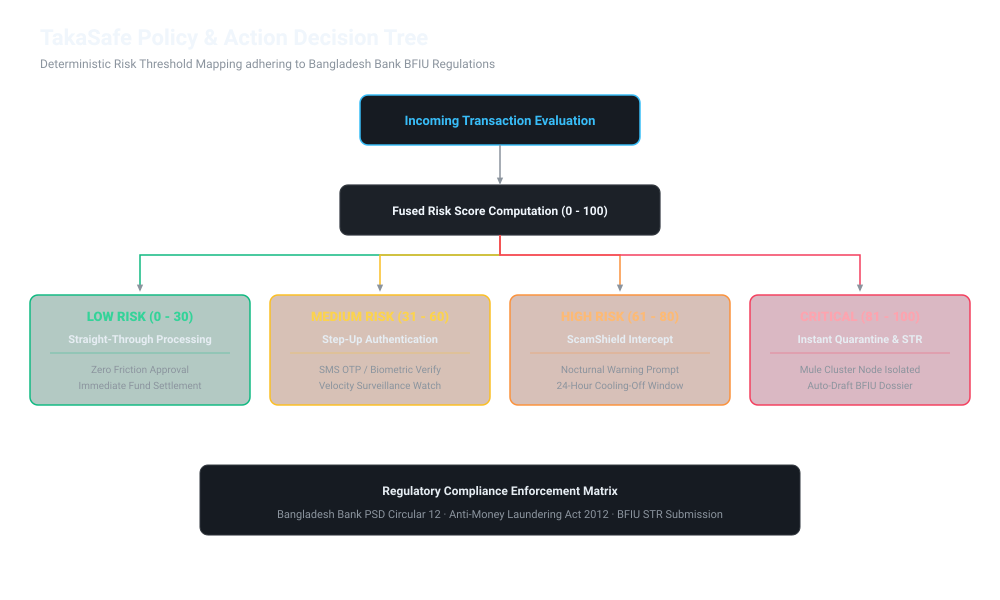
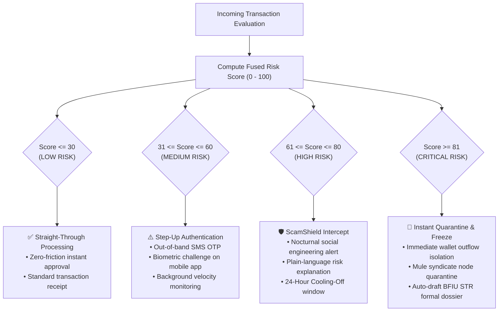

# TakaSafe - AI Financial Trust & Resilience Network
> **Explainable AI-Powered Fraud Intelligence, Mule Syndicate Defense, Consumer ScamShield & Disaster-Aware Liquidity Resilience for Mobile Financial Services (MFS)**

[](#-synthetic-data-declaration)
[](LICENSE)
[](https://react.dev/)
[](https://www.typescriptlang.org/)
[](https://tailwindcss.com/)
[](https://d3js.org/)
[](notebook/)
[](https://ai.google.dev/)
[](#-regulatory-compliance)
[](#-team--credits)

---

## 📌 Executive Summary

In Bangladesh's hyper-dense Mobile Financial Services (MFS) ecosystem (transacting over ৳4,000+ Crore daily across bKash, upay, and Nagad), fraud operations have evolved far beyond simple PIN phishing. Modern threats feature **coordinated mule syndicates**, **algorithmic pass-through rings**, **coercive social engineering scams**, and **disaster-driven rural cash liquidity shocks**.

**TakaSafe** is a multi-modal Financial Trust & Resilience Platform engineered for MFS operators, compliance officers, and rural consumers. It bridges machine learning risk scoring with **Explainable AI (SHAP)**, **Graph Network Analytics (MuleVision)**, **Predictive Agent Float Management**, and **Bangladesh Bank BFIU-compliant automated action engines**.

---

## 🧪 Synthetic Data Declaration

> ### ⚠️ Notice of Synthetic Data Usage
> All transaction logs, customer profiles, mule syndicate clusters, agent float records, and geospatial telemetry utilized in this project (`dataset/transactions.csv`, `src/data/mockData.ts`) are **100% strictly synthetic**.
>
> - **Statistical Grounding**: Synthetic datasets were procedurally generated using empirical distribution parameters characteristic of Bangladesh MFS networks (transaction amounts in BDT, velocity distributions, diurnal circadian patterns, seasonal cyclone disruptions, and nocturnal money mule anomalies).
> - **Zero Personally Identifiable Information (PII)**: No real customer identities, actual national IDs, phone numbers, or proprietary banking database records were harvested or utilized.
> - **Compliance**: Complies with the Bangladesh Bank Cyber Security Guidelines and BFIU Data Privacy & AML/CFT standards.

---

## 🏗️ System Architecture

The TakaSafe platform is designed with a modern decoupled architecture separating client interfaces, high-throughput API gateways, multi-modal model evaluation services, policy engines, and offline machine learning pipelines.



### Architectural Components:

1. **Frontend Presentation Layer (`React 19 + TypeScript on Vite / Cloud Run`)**:
   - **`Homepage + Overview`**: Real-time situational overview, executive metrics, and 3D resilience indicators.
   - **`Customer (TakaSafe Persona)`**: Mobile consumer MFS application simulator equipped with proactive **ScamShield** cognitive duress warnings and 24-hour cooling-off protection.
   - **`Agent (Float / Cash-out)`**: Agent liquidity portal for cash-in/out and automated armored distributor float dispatch.
   - **`Operations (Risk Cockpit)`**: Full-spectrum risk cockpit featuring live WebSocket feeds, tunable policy weights, division risk maps, and D3 force-directed mule graphs.

2. **API Gateway (`v1 routes · JWT · Rate Limit`)**:
   - Secure edge gateway handling authentication, role-based access control (RBAC), rate-limiting, and payload schema validation.

3. **Backend Core Services (`Express & Python ML Runtime`)**:
   - **`Model Services`**: Orchestrates fused risk scoring combining supervised XGBoost fraud probability with unsupervised Isolation Forest anomaly scoring.
   - **`Policy & Dynamic Rules`**: Mathematical policy weight coordinator ($R_{final} = \sum w_i \cdot s_i$) with one-click operational presets.
   - **`Brief: Gemini 2.5 Flash + Validator + Cache`**: Converts mathematical SHAP values into auditable, plain-language investigation dossiers and printable BFIU Suspicious Transaction Reports (STR).
   - **`Database / Ledger (cases · actions · audit)`**: Immutable transactional and regulatory action audit log.
   - **`Artifacts Storage (models · calibrators · forecasts)`**: Serialized model definitions (`xgboost_mfs_fraud_detector.json`), calibration curves, and feature schemas.

4. **Offline ML Training Pipeline (`Jupyter / Kaggle Notebooks NB00-NB99`)**:
   - Standalone data science environment (`notebook/xgboost_fraud_detection.ipynb`) for dataset ingestion, feature engineering, stratified cross-validation, hyperparameter tuning (`scale_pos_weight`), SHAP evaluation, and model artifact export.



---

## 🔄 End-to-End Evaluation Workflow

Every transaction processed through TakaSafe undergoes a rigorous 5-stage real-time evaluation pipeline with an SLA latency of **< 18 milliseconds**.





---

## 🌳 Policy & Action Decision Tree

TakaSafe maps the multi-modal risk score ($0 - 100$) to deterministic, regulatory-compliant intervention actions:





### Risk Tier Enforcement Matrix:

| Risk Tier | Score Band | Regulatory Action | User Experience | Compliance Mandate |
| :---: | :---: | :--- | :--- | :--- |
| **LOW** | `0 - 30` | **Straight-Through Processing** | Zero-latency instant approval | Standard audit logging |
| **MEDIUM** | `31 - 60` | **Step-Up Authentication** | Out-of-band SMS OTP or Biometric challenge | Bangladesh Bank PSD Circular 12 |
| **HIGH** | `61 - 80` | **ScamShield Pre-Payment Intercept** | Empathetic warning with 24-hour cooling-off choice | Consumer Protection Guidelines |
| **CRITICAL** | `81 - 100` | **Instant Quarantine & Freezing** | Outflow frozen; wallet isolated; BFIU STR drafted | Anti-Money Laundering Act 2012, Sec 19 |

---

## 🚀 Key Functional Modules

### 1. 🛡️ Transaction Guardian & Explainable AI (SHAP)
- **Multi-Modal Risk Scoring**: Fuses supervised XGBoost fraud probability with unsupervised Isolation Forest behavioral anomaly detection.
- **Explainable Feature Attribution**: Deconstructs every high-risk transaction into auditable SHAP contributions (e.g., Circadian Time Anomaly +12%, Velocity Spike +24%, Device Hardware Mismatch +17%).
- **Responsible Generative AI (Gemini 2.5 Flash)**: Converts structured mathematical features into plain-language, auditable case investigation dossiers for human fraud analysts.

### 2. 🕸️ MuleVision Graph Intelligence (D3 Force-Directed Network)
- **Deep Network Centrality Analysis**: Visualizes complex multi-wallet syndicates, aggregator hubs, and pass-through mule rings in real-time.
- **Shortest-Path Proximity & Hop Tracking**: Detects circular layering where funds hop across 10+ accounts before rapid cash-out.
- **1-Click Quarantine**: Authorizes immediate isolation and freezing of suspicious nodes with cryptographic audit ledger recording.

### 3. 🌊 Disaster Resilience Mode & Predictive Float Dispatch
- **Climate & Weather Shock Forecasting**: Models cash-out surges in coastal and flood-prone divisions (e.g., Cyclone Remal scenarios in Barishal and Patuakhali).
- **Proactive Float Routing**: Forecasts agent cash liquidity shortfalls up to 48 hours in advance, triggering automated armored distributor float dispatch before liquidity collapses.
- **Humanitarian Emergency Relief Mode**: Dynamically lowers false-positive friction for emergency aid disbursements while maintaining vigilant device-level anti-takeover shields.

### 4. 📡 Early-Warning Radar & Geospatial Intelligence
- **Interactive Bangladesh Geospatial Risk Map**: Visualizes real-time divisional risk indexes across all 8 administrative divisions (Dhaka, Chittagong, Sylhet, Barishal, Khulna, Rajshahi, Rangpur, Mymensingh).
- **Division Risk Radar**: 360-degree situational awareness aggregating velocity spikes, account takeover spikes, network density, and agent float stress.

### 5. 📱 ScamShield Consumer Mobile Simulator
- **Billionaire-Grade Sovereign Card**: High-net-worth Centurion-inspired digital account card with multi-layer security guilloché lathe-work, engraved sovereign watermark, metallic EMV microchip, and active cryptographic seal.
- **Cognitive Coercion Defense**: Intercepts nocturnal transfers to unverified accounts with empathetic ScamShield dialogs and clear back/cross controls.

### 6. 📑 BFIU Compliance & Regulatory Report Generator
- **Audit-Ready Suspicious Transaction Reports (STR)**: Generates formal printable compliance dossiers adhering to the Anti-Money Laundering Act, 2012 and Bangladesh Bank BFIU guidelines.
- **Electronic Sign-Off Ledger**: Formal digital authorization attributed to Authorized AML Officers.

---

## 🛠️ Technology Stack

| Layer | Technology | Purpose |
| :--- | :--- | :--- |
| **Frontend Framework** | React 19 + TypeScript | High-performance, type-safe reactive UI |
| **Build & Tooling** | Vite 8 + TSX | Instant HMR development and optimized production bundles |
| **Styling & Design** | Tailwind CSS v4 | Custom banking aesthetics, responsive grid, and dark mode support |
| **Data Visualization** | D3.js v7 + Recharts | Force-directed mule graphs, donut charts, and risk trend metrics |
| **Machine Learning** | XGBoost 2.0+ & Scikit-Learn | Supervised fraud classification & behavioral anomaly detection |
| **Explainable AI** | SHAP (SHapley Additive exPlanations) | Game-theoretic mathematical feature attribution |
| **Generative AI** | `@google/genai` (Gemini 2.5 Flash) | Server-side explainable case synthesis and SHAP narration |
| **Backend & APIs** | Node.js + Express | REST APIs for audit actions, logs, investigation briefs, and health checks |
| **Iconography** | Lucide React | Clean, domain-specific fintech iconography |

---

## 📐 Mathematical Formulation

TakaSafe enforces a deterministic composite risk function:

$$R_{\text{final}} = w_{\text{fraud}} \cdot s_{\text{fraud}} + w_{\text{anomaly}} \cdot s_{\text{anomaly}} + w_{\text{velocity}} \cdot s_{\text{velocity}} + w_{\text{device}} \cdot s_{\text{device}} + w_{\text{network}} \cdot s_{\text{network}} + w_{\text{scam}} \cdot s_{\text{scam}}$$

$$\text{subject to } \sum w_i = 1.00 \quad (100\%)$$

| Signal Engine | Default Weight ($w_i$) | Underpinning Algorithmic Model |
| :--- | :---: | :--- |
| **Supervised Fraud Probability** | $0.30$ | XGBoost Classifier v4.2 trained on MFS attack vectors |
| **Behavioral Anomaly Baseline** | $0.20$ | Isolation Forest benchmarking 90-day spending history |
| **Transaction Velocity Index** | $0.15$ | Rolling temporal sliding window (10m & 60m frequency) |
| **Device Hardware Integrity** | $0.15$ | IMEI change, SIM swap, IP mismatch & nocturnal timing |
| **Mule Graph Centrality** | $0.10$ | Graph Neural Network (GNN) shortest-path clustering |
| **Social Engineering Risk** | $0.10$ | Pre-payment cognitive duress & lottery scam heuristics |

---

## 📂 Project Directory Structure

```plaintext
takasafe/
├── LICENSE                         # Official MIT License
├── README.md                       # Main platform documentation & diagrams
├── server.ts                       # Express backend + Gemini 2.5 Flash proxy
├── vite.config.ts                  # Vite + React configuration
├── package.json                    # Project dependencies & scripts
├── metadata.json                   # AI Studio applet metadata & capabilities
├── dataset/
│   └── transactions.csv            # 8,000-row synthetic MFS transaction dataset (40 features)
├── notebook/
│   ├── xgboost_fraud_detection.ipynb # 34-cell end-to-end Jupyter Notebook
│   ├── xgboost_fraud_detection.py    # Interactive Python script (# %% cell format)
│   ├── requirements.txt            # Python dependencies (xgboost, shap, scikit-learn)
│   └── README.md                   # Notebook documentation & model benchmarks
├── docs/
│   ├── architecture.svg            # Full system architecture diagram
│   ├── workflow.svg                # 5-step evaluation workflow diagram
│   └── decision_tree.svg           # Deterministic policy decision tree diagram
├── src/
│   ├── main.tsx                    # React application entry point
│   ├── App.tsx                     # Core state coordinator & layout
│   ├── index.css                   # Global styles & MFS signature animations
│   ├── types/
│   │   └── index.ts                # Strict TypeScript domain interfaces
│   ├── data/
│   │   └── mockData.ts             # High-fidelity synthetic MFS datasets
│   └── components/
│       ├── common/
│       │   ├── UpayHeader.tsx      # Top navigation with animated MFS logo
│       │   ├── UpayFooter.tsx      # Corporate footer & brand links
│       │   └── UpayInfoModal.tsx   # Platform accreditation & team details
│       ├── auth/
│       │   └── LoginPage.tsx       # Role-based authentication (Admin / User)
│       ├── operator/
│       │   ├── OperatorDashboard.tsx            # Main operator surveillance hub
│       │   ├── PolicyWeightsActionEngine.tsx    # Policy tuner & action engine matrix
│       │   ├── MuleVisionGraph.tsx              # D3 force-directed syndicate graph
│       │   ├── DisasterResilienceSimulator.tsx  # Cyclone/flood cash shock engine
│       │   ├── EarlyWarningRadar.tsx            # Multi-modal risk radar
│       │   ├── GeospatialIntelligenceMap.tsx    # Division risk & agent liquidity map
│       │   ├── ComplianceReportModal.tsx        # Printable BFIU STR report modal
│       │   ├── LiveWebSocketTicker.tsx          # Real-time transaction stream
│       │   ├── TransactionRiskTrendChart.tsx    # 24-hour temporal risk charts
│       │   └── RiskDistributionDonutChart.tsx   # Severity distribution donut
│       └── customer/
│           ├── CustomerAppView.tsx              # Mobile consumer MFS app
│           ├── TakaSafeSovereignCard.tsx        # Centurion-inspired luxury card
│           └── QRCodeScannerModal.tsx           # QR scanner & wallet handshake modal
```

---

## 💻 Getting Started

### Prerequisites
- **Node.js**: `v20.x` or higher
- **Package Manager**: `npm` or `bun`
- **Google Gemini API Key** (optional, high-quality deterministic fallback is built-in): Obtainable from [Google AI Studio](https://aistudio.google.com/).

### Installation

1. **Clone the repository**:
   ```bash
   git clone https://github.com/your-org/takasafe.git
   cd takasafe
   ```

2. **Install dependencies**:
   ```bash
   npm install
   ```

3. **Configure Environment Variables**:
   ```bash
   cp .env.example .env
   ```
   Add your Gemini API key:
   ```env
   GEMINI_API_KEY=your_actual_gemini_api_key_here
   PORT=3000
   ```

4. **Start Development Server**:
   ```bash
   npm run dev
   ```
   Open your browser at `http://localhost:3000`.

5. **Build for Production**:
   ```bash
   npm run build
   npm run start
   ```

---

## 🔒 Regulatory Compliance

TakaSafe is architected to satisfy Bangladesh regulatory and cybersecurity mandates:
- **Anti-Money Laundering Act, 2012 (Section 19)**: Mandatory Suspicious Transaction Reporting (STR) format.
- **BFIU Guidelines on AML/CFT for MFS Providers (2026)**: Explainable decision logging and anti-mule clustering.
- **Bangladesh Bank PSD Circular 12**: Out-of-band step-up authentication thresholds and escrow reviews.
- **Consumer Protection Directive**: Customer-empowered 24-hour delay window for suspected social engineering.

---

## 📄 License

This project is licensed under the **MIT License** — see the [LICENSE](LICENSE) file for details.

---

## 👥 Team & Credits

**Team 3AM Runtime** — Developed for the **DIU CPC × upay National Hackathon 2026**:

- **Md. Tanvir Hasan** — Chief Risk Analyst & Lead Architect
- **Sourov Kumar** — SOC Operations & Risk Governance
- **Md. Sadman Al Islam Shabab** — Model Architecture & Explainability Lead

*Special thanks to Daffodil International University (DIU CPC) and upay (UCB Fintech Company Limited) for supporting innovations in financial inclusion, fraud intelligence, and digital trust.*
